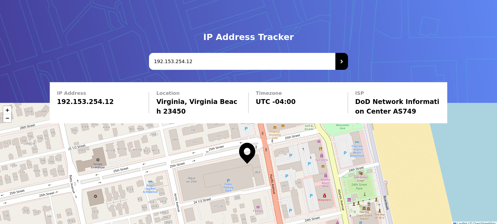

# Frontend Mentor - IP address tracker solution

This is a solution to the [IP address tracker challenge ](https://www.frontendmentor.io/challenges/ip-address-tracker-I8-0yYAH0). Frontend Mentor challenges help you improve your coding skills by building realistic projects.

## Table of contents

- [Overview](#overview)
  - [The challenge](#the-challenge)
  - [Screenshot](#screenshot)
  - [Links](#links)
- [My process](#my-process)
  - [Built with](#built-with)
  - [Useful resources](#useful-resources)
- [Author](#author)

**Note: Delete this note and update the table of contents based on what sections you keep.**

## Overview

### The challenge

Build an IP address tracker and display the location of the IP address via leafletjs map API.

Users should be able to:

- View the optimal layout for each page depending on their device's screen size
- See hover states for all interactive elements on the page
- See their own IP address on the map on the initial page load
- Search for any IP addresses or domains and see the key information and location

### Screenshot

### Links

- Solution URL: [(https://github.com/DrZero1234/FEM_IP_tracker]
- Live Site URL: [https://your-live-site-url.com]

## My process

### Built with

- Semantic HTML5 markup
- CSS custom properties
- Flexbox
- CSS Grid

### Useful resources

- [CSS tricks](https://css-tricks.com/snippets/css/complete-guide-grid/) - If you are working with grids this is the site you should visit first.
- [leafletjs](https://leafletjs.com/reference.html) - The official documentation for the map API.
- [geo.ipify](https://geo.ipify.org/docs) - The official documentation for the IP/email/domain location API.

**Note: Delete this note and replace the list above with resources that helped you during the challenge. These could come in handy for anyone viewing your solution or for yourself when you look back on this project in the future.**

## Author

- Frontend Mentor - [@DrZero1234](https://www.frontendmentor.io/profile/DrZero1234)
- GitHub - [@DrZero1234](https://github.com/DrZero1234)
